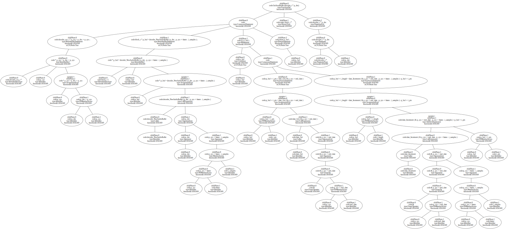
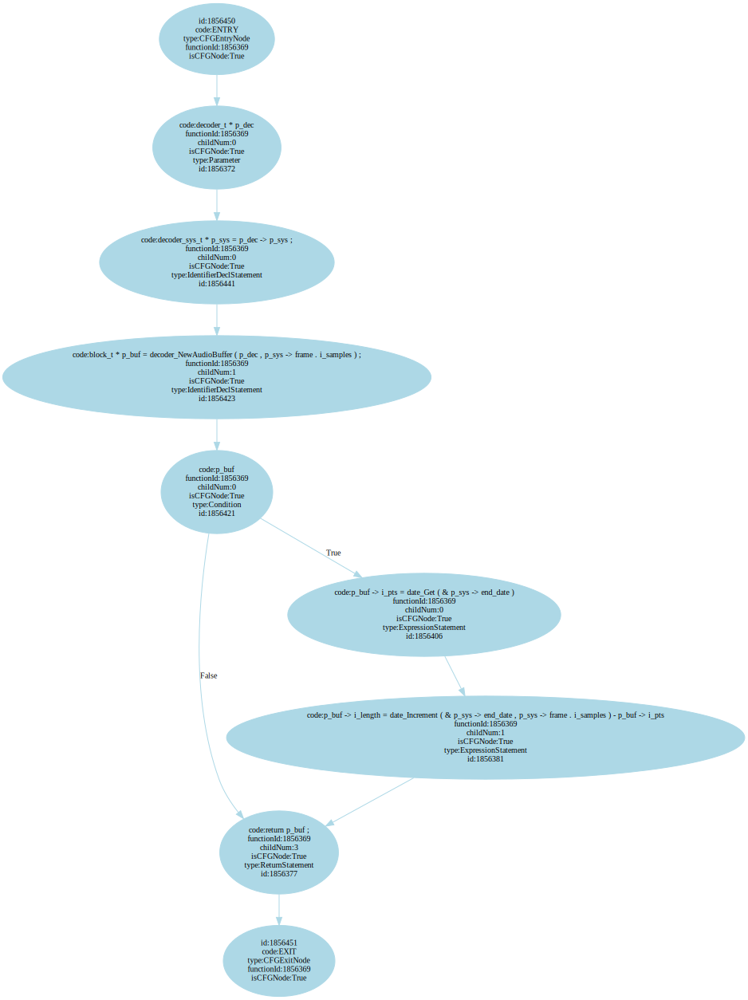
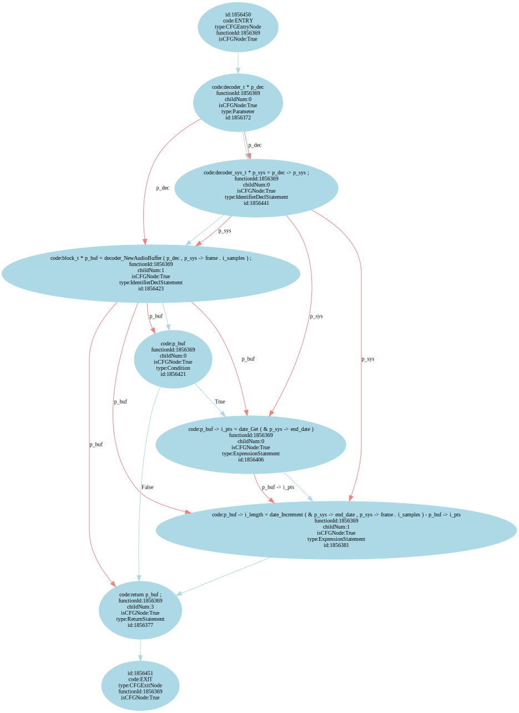
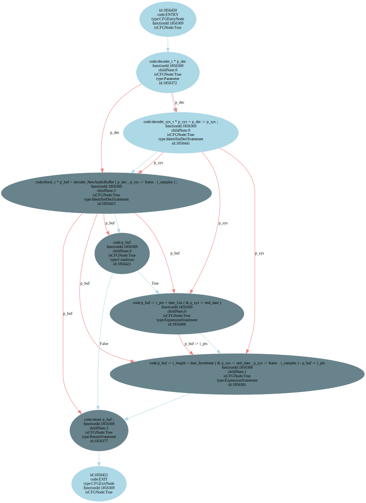

Code Analysis with joern-tools (Work in progress)
=================================================

..
   Short introduction/motivation

This tutorial shows how the command line utilities ``joern-tools`` can
be used for code analysis on the shell. These tools have been created
to enable fast programmatic code analysis, in particular to hunt for
bugs and vulnerabilities. Consider them a possible addition to your
GUI-based code browsing tools and not so much as a replacement. That
being said, you may find yourself doing more and more of your code
browsing on the shell with these tools.

This tutorial offers both short and concise commands that *get a job
done* as well as more lengthly queries that illustrate the inner
workings of the code analysis platform ``joern``. The later have been
provided to enable you to quickly extend ``joern-tools`` to suit your
specific needs.

**Note:** If you end up writing tools that may be useful to others,
please don't hesitate to send a pull-request to get them included in
``joern-tools``.

Importing the Code
-------------------

As an example, we will analyze the VLC media player, a medium sized
code base containing code for both Windows and Linux/BSD. It is
assumed that you have successfully installed joern into the directory
``$JOERN`` as described in :doc:`../installation`. To begin, you can
download and import the code as follows:

.. code-block:: none

	cd $JOERN
	mkdir tutorial; cd tutorial
	wget http://download.videolan.org/pub/videolan/vlc/2.1.4/vlc-2.1.4.tar.xz
	tar xfJ vlc-2.1.4.tar.xz
	tar zcf vlc-2.1.4.tar.gz vlc-2.1.4/
	cd ..

Next, start the joern-server:

.. code-block:: none

	./joern-server

Open a new terminal and import the code:

.. code-block:: none

	cd $JOERN
	joern-import tutorial/vlc-2.1.4.tar.gz

Exploring Database Contents
---------------------------

Inspecting node and edge properties
""""""""""""""""""""""""""""""""""""

To send custom queries to the database, you can use the tool
``joern-lookup``. By default, ``joern-lookup`` will perform node index
lookups (see `Fast lookups using the Node Index`_). For Gremlin
queries, the ``-g`` flag can be specified. Let's begin by retrieving
all nodes directly connected to the root node using a Gremlin query:

.. code-block:: none

	echo 'g.v(0).out()' | joern-lookup -g

	(1 {"type":"Directory","filepath":"tutorial/vlc-2.1.4"})

If this works, you have successfully injected a Gremlin script into
the Neo4J database using the REST API via ``joern-tools``
. Congratulations, btw. As you can see from the output, the reference
node has a single child node. This node has two *attributes*: "type"
and "filepath". In the joern database, each node has a "type"
attribute, in this case "Directory". Directory nodes in particular
have a second attribute, "filepath", which stores the complete path to
the directory represented by this node.

Let's see where we can get by expanding outgoing edges:

.. code-block:: none

	# Syntax
	# .outE(): outgoing Edges

	echo 'g.v(0).out().outE()' | joern-lookup -g | sort | uniq -c

	14 IS_PARENT_DIR_OF

This shows that, while the directory node only contains its path in
the *filepath* attribute, it is connected to its sub-directories by
edges of type *IS_PARENT_DIR_OF*, and thus its position in the
directory hierarchy is encoded in the graph structure.

**Filtering.** Starting from a directory node, we can recursively
enumerate all files it contains and filter them by name. For example,
the following query returns all files in the directory 'demux':

.. code-block:: none

	# Syntax
	# .filter(closure): allows you to filter incoming objects using the
	# supplied closure, e.g., the anonymous function { it.type ==
	# 'File'}. 'it' is the incoming pipe, which means you can treat it
	# just like you would treat the return-value of out().
	# loop(1){true}{true}: perform the preceeding traversal
	# exhaustively and emit each node visited

	echo 'g.v(0).out("IS_PARENT_DIR_OF").loop(1){true}{true}.filter{ it.filepath.contains("/demux/") }' | joern-lookup -g

File nodes are linked to all definitions they contain, i.e., type,
variable and function definitions. Before we look into functions,
let's quickly take a look at the *node index*.

Fast lookups using the Node Index
"""""""""""""""""""""""""""""""""

Before we discuss function definitions, let's quickly take a look at
the node index, which you will probably need to make use of in all but
the most basic queries. Instead of walking the graph database from its
root node, you can lookup nodes by their properties. Under the hood,
this index is implemented as an Apache Lucene Index and thus you can
make use of the full Lucene query language to retrieve nodes. Let's
see some examples.

.. code-block:: none

	echo "type:File AND filepath:*demux*" | joern-lookup -c

.. code-block:: none

	echo 'queryNodeIndex("type:File AND filepath:*demux*")' | joern-lookup -g

Advantage:

.. code-block:: none

	echo 'queryNodeIndex("type:File AND filepath:*demux*").out().filter{it.type == "Function"}.name' | joern-lookup -g

Plotting Database Content
-------------------------

To enable users to familarize themselves with the database contents
quickly, ``joern-tools`` offers utilities to retrieve graphs from the
database and visualize them using *graphviz*.

**Retrieve functions by name**

.. code-block:: none

	echo 'getFunctionsByName("GetAoutBuffer").id' | joern-lookup -g | joern-location

	/home/fabs/targets/vlc-2.1.4/modules/codec/mpeg_audio.c:526:0:19045:19685
	/home/fabs/targets/vlc-2.1.4/modules/codec/dts.c:400:0:13847:14459
	/home/fabs/targets/vlc-2.1.4/modules/codec/a52.c:381:0:12882:13297

Usage of the shorthand getFunctionsByName. Reference to python-joern.

.. code-block:: none

	echo 'getFunctionsByName("GetAoutBuffer").id' | joern-lookup -g | tail -n 1 | joern-plot-ast > foo.dot

**Plot abstract syntax tree**

Take the first one, use joern-plot-ast to generate .dot-file of AST.

.. code-block:: none

	dot -Tsvg foo.dot -o ast.svg; eog ast.svg

**Plot control flow graph**

.. code-block:: none

	 echo 'getFunctionsByName("GetAoutBuffer").id' | joern-lookup -g | tail -n 1 | joern-plot-proggraph -cfg > cfg.dot;
	dot -Tsvg cfg.dot -o cfg.svg; eog cfg.svg

**Show data flow edges**

.. code-block:: none

	 echo 'getFunctionsByName("GetAoutBuffer").id' | joern-lookup -g | tail -n 1 | joern-plot-proggraph -ddg -cfg > ddgAndCfg.dot;
	dot -Tsvg ddgAndCfg.dot -o ddgAndCfg.svg; eog ddgAndCfg.svg

**Mark nodes of a program slice**

.. code-block:: none

	echo 'getFunctionsByName("GetAoutBuffer").id' | joern-lookup -g | tail -n 1 | joern-plot-proggraph -ddg -cfg | joern-plot-slice 1856423 'p_buf' > slice.dot;
	dot -Tsvg slice.dot -o slice.svg;

Note: You may need to exchange the id: 1856423.

Selecting Functions by Name
---------------------------

Lookup functions by name

.. code-block:: none

	echo 'type:Function AND name:main' | joern-lookup

Use Wildcards:

.. code-block:: none

	echo 'type:Function AND name:*write*' | joern-lookup

Output all fields:

.. code-block:: none

	echo 'type:Function AND name:*write*' | joern-lookup -c

Output specific fields:

.. code-block:: none

	echo 'type:Function AND name:*write*' | joern-lookup -a name

Shorthand to list all functions:

.. code-block:: none

	joern-list-funcs

Shorthand to list all functions matching pattern:

.. code-block:: none

	joern-list-funcs -p '*write*

List signatures

echo "getFunctionASTsByName('*write*').code" | joern-lookup -g

Lookup by Function Content
--------------------------

**Lookup functions by parameters:**

.. code-block:: none

	echo "queryNodeIndex('type:Parameter AND code:*len*').functions().id" | joern-lookup -g

Shorthand:

.. code-block:: none

	echo "getFunctionsByParameter('*len*').id" | joern-lookup -g

From function-ids to locations: joern-location

.. code-block:: none

	echo "getFunctionsByParameter('*len*').id" | joern-lookup -g | joern-location

Dumping code to text-files:

.. code-block:: none

	echo "getFunctionsByParameter('*len*').id" | joern-lookup -g | joern-location | joern-code > dump.c

Zapping through locations in an editor:

.. code-block:: none

	echo "getFunctionsByParameter('*len*').id" | joern-lookup -g | joern-location | tail -n 2 | joern-editor

Need to be in the directory where code was imported or import using full paths.

**Lookup functions by callees:**

.. code-block:: none

	echo "getCallsTo('memcpy').functions().id" | joern-lookup -g

You can also use wildcards here. Of course, joern-location, joern-code
and joern-editor can be used on function ids again to view the code.

List calls expressions:

.. code-block:: none

	echo "getCallsTo('memcpy').code" | joern-lookup -g

List arguments:

.. code-block:: none

	echo "getCallsTo('memcpy').ithArguments('2').code" | joern-lookup -g

Analyzing Function Syntax
-------------------------

- Plot of AST
- locate sub-trees and traverse to statements

Analyzing Statement Interaction
-------------------------------

- some very basic traversals in the data flow graph
